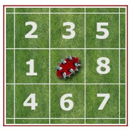

```{r}
library(dplyr)
library(kableExtra)
library(ggplot2)
library(tidyverse)
```


# Quelques notes : 

Dans l'ensemble du documents, le terme de probabilité sera utilisée, mais les valeurs sont exprimées en pourcentage. En effet, pour la majorité des gens, il est plus facile d'appréhender une valeur entre 0 et 100% qu'entre 0 et 1. 

# Passage d'une Armure

Dans Bloodbowl, quand un joueur est mis à terre, un test d'armure doit être réalisé dans la majorité des cas (pas toujours mais souvent). Un joueur est caractérisé par une caractéritique d'armure de type 8+. Pour savoir si l'armure est "*passée*" (et que le joueur sera donc potentiellement blessé), on teste si la somme de 2D6 équilibrés égale au moins la valeur d'armure. On peut donc calculer la probabilité de passer une armure.

On va déja calculer l'ensemble de probabilité d'obtenir chaque valeur, à partir de 2D6 équilibré, ce qui donne 36 possibilités (on considère que 1 + 6 est différent de 6 + 1 d'un point de vue combinatoire). On va donc calculer la probabilité de chaque valeur obtenue par la somme des deux dés. 

```{r}
# On Crée toutes les combinaisons
Data.2D6=expand.grid(
  D1=seq(1,6),
  D2=seq(1,6)
) %>% 
  mutate(Total=D1+D2) %>% # Calcul de la somme des deux dés
  group_by(Total) %>% # On regroupe par valeur de somme
  summarize(Nb.Cas=n()) %>% # on compte le nombre de cas où cela arrive
  mutate(Proba=Nb.Cas/36*100) # On calcule la probabilité (en %)

Data.2D6 %>% kable(col.names = c("Somme des dés","Nombre de Cas","Probabilité"),digits=2)

```

Sauf que dans notre cas, si on doit faire au moins 7, et que l'on obtient 8, cela passe donc aussi. Il faut donc ajouter les valeurs supérieurs au résultat nécessaire. 

```{r}
Data.Armure = Data.2D6 %>% 
  arrange(-Total) %>% 
  mutate(Nb.Cas=cumsum(Nb.Cas))%>% 
  mutate(Proba=Nb.Cas/36*100) %>% 
  arrange(Total) %>% 
  mutate(Armure=paste0(Total,"+"))

Data.Armure %>% 
  select(Armure,Nb.Cas,Proba) %>% 
  kable(col.names = c("Armure à passer","Nombre de Cas favorable","Probabilité"),digits=2)
```

Dans certains cas, il est possible d'avoir un bonus pour passer l'armure. C'est par exemple le cas de la compétence *Chataîgne* qui donne en général +1 à l'armure (Il y a d'autres cas, mais c'est le cas le plus probable). On peut alors calculer l'effet d'avoir un tel bonus, en absolu et en relatif

```{r}
Data.Armure %>% 
  mutate(Delta.Abs=lag(Proba,1)-Proba,
         Delta.Relatif=(lag(Proba,1)-Proba)/Proba*100) %>% 
  select(-Nb.Cas) %>% 
  arrange(Total)%>% 
  select(Armure,Proba,Delta.Abs,Delta.Relatif) %>% 
  kable(col.names = c("Armure à passer","Probabilité","Ecart Absolu","Ecart Relatif"),digits=2)
```

Ce tableau note deux choses intéressantes. Le premier point, c'est que le bonus en gain absolu est le plus élevé sur une armure en 8+, avec un gain de 16.67%, pour arriver à un total de succès de 58.33% de réussite. Cependant, en relatif, c'est dans le gas d'une armure 12+ où c'est le plus intéressant, avec une probabilité de succès multipliée par 3 (+200% en relatif). Il y a souvent des discussions sur dans quels moments ces bonus sont les plus impactants. Dans notre cas, on se rend compte que cela dépend de la façon de comparer. Sur la probabilité de réussite, c'est le plus intéressant sur une armure 8+ initiale, mais qu'en relatif, c'est quand l'armure est à 12+ que le gain est le plus élevé. 


## Et la blessure du joueur.

Si l'armure est "*passée*", il faut réaliser un jet de blessure. On lance encore ici deux D6 que l'on somme, et le résultat donne la blessure du joueur :
- 8-7 : Sonné, le joueur ratera le prochain tour
- 8-9 : KO, le joueur reviendra peut-être au prochain engagement
- 10+ : Elimination, la blessure est assez grave, et le joueur ne reviendra pas du match.

On procède comme précedemment, en regroupant les cas ménants à la même blessur. On obtient alors le tableau suivant 

```{r}
Data.Blessure = Data.2D6 %>% 
  mutate(Blessure=case_when(Total<=7~"Sonné",
                            Total<=9~"KO",
                            T~"Eliminé")) %>% 
  mutate(Blessure=factor(Blessure,levels=c("Sonné","KO","Eliminé"))) %>% 
  group_by(Blessure) %>% 
  summarize(Nb.Cas=sum(Nb.Cas)) %>% 
  mutate(Proba=Nb.Cas/36*100)
 
Data.Blessure %>% select(-Nb.Cas) %>% 
  kable(col.names=c("Blessure","Probabilité (%)"))
```


## Et si on combine les deux ?
### Cas simple : Pas de bonus

Dans ce cas, on peut simplement faire la multiplication des  obtenues sur les deux cas précédents. En réalisant cela, on peut, pour chaque caractéristique d'armure, estimer la probabilité d'avoir chaque blessure (en tenant compte du fait de passer l'armure). Les deux étant indépendants, on obtient simplement ces cas en multipliant les probabilités calculées précédemment. 

```{r}
Data.Arm.Blessure = expand.grid(Armure=paste0(seq(2,12),"+"),
                                Blessure=c("Sonné","KO","Eliminé"))%>% 
  mutate(Blessure=factor(Blessure,levels=c("Sonné","KO","Eliminé"))) %>% 
  left_join(.,{
    Data.Armure %>% select(Armure,Total,Proba) %>% 
      rename(Proba.Armure=Proba)
  },by="Armure") %>% 
  left_join(.,{
    Data.Blessure %>% 
      select(Blessure,Proba) %>% 
      rename(Proba.Blessure=Proba)
  },by="Blessure") %>% 
  mutate(Prob.Total=Proba.Armure*Proba.Blessure/100) %>% 
 dplyr:: select(Armure,Total,Blessure,Prob.Total) %>% 
  spread(Blessure,Prob.Total) %>% arrange(Total)
Data.Arm.Blessure %>% 
  select(-Total) %>% 
  kable(digits=2)
```

### Deuxième Cas : Bonus uniquement à l'armure

Dans ce cas, on peut simplement reprendre les résultats précédents, en baissant juste la valeur de l'armure de test que du test. Par exemple, lors d'un tronçonnage, on gagne +3 à l'armure. Pour une caractéristique d'armure de 10+, cela revient donc à reprendre une caractéristique d'armure de 7+. Le tableau précédent redevient vrai.

### Troisième Cas : Bonus +1 à appliquer à l'armure ou à la blessure.

Une compétence comme *chataîgne* permet d'appliquer d'un bonus de +1 à l'armure ou à la blessure. Dans ce cas, la situation est un peu plus compliquée d'un point de vue combinatoire. Pour la simplifier, on peut séparer deux situations. La première est celle où l'armure est *passée* sans utiliser le bonus. On l'utilise alors de façon systématique sur la blessure, même si le résultat ne sera pas impacté. Le second cas est celui où il faut utiliser le bonus de +1 pour l'armure, et on réalise alors un jet de blessure sans bonus. Ceci nous donne 

```{r}
# On crée le tableau de blessure avec le bonus
# Cela revient à baisser de 1 la valeur nécessaire (7-8 KO, 9+ Eliminination)
Data.Blessure.Chat = Data.2D6 %>% 
  mutate(Blessure=case_when(Total<=6~"Sonné",
                            Total<=8~"KO",
                            T~"Eliminé"))%>% 
  mutate(Blessure=factor(Blessure,levels=c("Sonné","KO","Eliminé"))) %>% 
  group_by(Blessure) %>% 
  summarize(Nb.Cas=sum(Nb.Cas)) %>% 
  mutate(Proba=Nb.Cas/36*100)

# On teste des armures de 3+ à 12+
Armure.Test = c(3:12)
# On initialise le cas particulier 2+, où le bonus n'es utilisé que sur la blessure
Data.Chat= Data.Blessure.Chat %>% 
  select(-Nb.Cas) %>% 
  rename(Prob.Tot=Proba) %>% 
  mutate(Armure="2+",Total=2)
# On réalise une boucle pour chaque baleur
for(Ar in Armure.Test){
  # On crée un tableau avec l'armure et les valeurs de blessure
  temp = expand.grid(Total=Ar,
                     Blessure=c("Sonné","KO","Eliminé")) %>% 
    # On ajoute le cas ou le bonus est utilisé sur la blessure
    left_join(.,{Data.Armure %>% 
        select(-Nb.Cas) %>% 
        rename(Proba.Ar=Proba)},by="Total") %>% 
    left_join(.,{Data.Blessure.Chat %>% 
        select(-Nb.Cas) %>% 
        rename(Proba.Ble=Proba)},by="Blessure") %>% 
    # On ajoute en plus le cas ou le bonus est utilisé sur l'armuyre
    bind_rows(.,{
      expand.grid(Total=Ar-1,
                     Blessure=c("Sonné","KO","Eliminé")) %>% 
    left_join(.,{Data.2D6 %>% # Dans ce cas, seul la valeur à Armure -1 nous intéresse, les autres sont déjà pris en compte
        select(-Nb.Cas) %>% 
        rename(Proba.Ar=Proba)},by="Total") %>% 
    left_join(.,{Data.Blessure %>% 
        select(-Nb.Cas) %>% 
        rename(Proba.Ble=Proba)},by="Blessure")
    }) %>% 
    # On calcule la probabilité de chaque cas
    mutate(Prob.Tot=Proba.Ar*Proba.Ble/100) %>% 
    group_by(Blessure) %>% 
    summarise(Prob.Tot=sum(Prob.Tot)) %>% 
    # On regroupe les blessures similaires
    mutate(Armure=paste0(Ar,"+"),Total=Ar)
  # On concaténe les résultats avec les précédents obtenus
  Data.Chat = Data.Chat %>% bind_rows(.,temp)
}
# Mise en forme des résultats
Data.Chat%>% 
  spread(Blessure,Prob.Tot)%>% arrange(Total) %>% 
  select(-Total) %>% 
  kable(digits=2)
```


# Un ballon qui ricoche
Quand un ballon ricoche, cela équivaut à 3 rebond autour de la case initiale. Pour cela, on lance 3D8 que l'on résout les uns après les autres à partir de la position initiale. Si on considère un D8 équilibré, et que l'on part de la disposition suivante de déviation, et que l'on lance trois fois le dés, on peut estimer que tous les enchainements sont équiprobaux.




```{r}
# On crée toutes les combinaisons sur les 3 dés 8 faces (D1, D2 et D3)
# on a donc 8^3 cas, ce qui donne 512 cas de lancer de dés différents, mais certains donnent le même résultat. On va calculer la probabilité de chacun
Data.Dev <- expand.grid(
  D1=seq(1,8),
  D2=seq(1,8),
  D3=seq(1,8)
) %>% 
  # On initialise la position de 
  # x = position sur la largeur du terrain
  # y = position sur la longueur du terrain
  mutate(x=0,y=0) %>% 
  # On résout le premier D,
  mutate(x=case_when(D1 %in% c(1,2,4)~x-1,
                     D1 %in% c(5,7,8)~x+1,
                     T~x),
         y=case_when(D1 %in% c(2,3,5) ~y+1,
                     D1 %in% c(4,6,7) ~y-1,
                     T ~y)) %>% 
  # On résout le 2e cas
  mutate(x=case_when(D2 %in% c(1,2,4)~x-1,
                     D2 %in% c(5,7,8)~x+1,
                     T~x),
         y=case_when(D2 %in% c(2,3,5) ~y+1,
                     D2 %in% c(4,6,7) ~y-1,
                     T ~y)) %>% 
  # on résout le 3e cas
  mutate(x=case_when(D3 %in% c(1,2,4)~x-1,
                     D3 %in% c(5,7,8)~x+1,
                     T~x),
         y=case_when(D3 %in% c(2,3,5) ~y+1,
                     D3 %in% c(4,6,7) ~y-1,
                     T ~y)) %>% 
  # On regroupe pour les situations donnant la même case finale. 
  group_by(x,y) %>% 
  summarize(Nb=n()) %>% 
  mutate(Proba=Nb/512*100)

```


```{r}
Data.Dev %>%
  select(-Nb) %>% head() %>% 
  kable(caption="Aperçu des probabilités lors d'un rebond de ballon")
```

On a donc pour chaque position la probabilité qu'elle soit obtenue. A partir de 512 possibilités de dés, il ne reste que 49 cases possibles (+3/-3 max dans chaque direction, soit un carré de 7x7). On peut simplement regarder le tableau et se dire la probabilité. Si on le regarde, on s'apercoit que certaines situations sont équiprobables. Par exemple, le (-3,1) et le (-3,1) sont équivalents. On peut donc imaginer le représenter sur un graphique


```{r}
Data.Dev %>% 
  mutate(Proba.display=round(Proba,2)) %>% 
  ggplot(aes(x=x,y=y))+
  geom_text(aes(label=Proba.display))
```
L'idéal serait de faciliter la lecture. On peut essayer de construire une heatmap.

```{r}
Data.Graph = Data.Dev %>% 
  mutate(y.pos=y-0.5) %>% 
  bind_rows(.,{Data.Dev %>% 
  mutate(y.pos=y+0.5) })%>% 
  mutate(Proba.display=(round(Proba,2)),
         Position=paste0("(",x,",",y,")"),
         x.min=x-0.5,x.max=x+0.5,) %>% 
  arrange(Position)
Data.Graph %>% 
  ggplot(aes(x=x,y=y.pos,group=Position,fill=Proba))+
  geom_ribbon(aes(xmin=x.min,xmax=x.max))+
  theme_classic()+
  geom_text(data={Data.Dev %>% mutate(Proba.display=(round(Proba,2)),
                                      Position=paste0("(",x,",",y,")"))},aes(label=Proba.display,y=y))+
  labs(x="Largeur",y="Longueur")+
  scale_fill_gradient(low = "yellow", high = "red", na.value = NA)+
  theme(legend.position = "none")
```


On peut aussi imaginer de regrouper par type de position de probabilité pour faciliter la lecture

```{r}
Data.Dev %>% 
  mutate(Proba.display=round(Proba,2)) %>% 
  group_by(Proba.display) %>% 
  summarize(Prob.Group=sum(Proba)) %>% 
  full_join(.,Data.Graph,by="Proba.display") %>% 
  ggplot(aes(x=x,y=y.pos,group=Position,fill=Proba.display),color="black")+
  geom_ribbon(aes(xmin=x.min,xmax=x.max),color="black",outline.type = "full")+
  theme_classic()+
  labs(x="Largeur",y="Longueur")+
  scale_fill_gradient(low = "yellow", high = "red", na.value = NA,name="Probabilité (%)")+
  theme(legend.position = "bottom")
  
```


